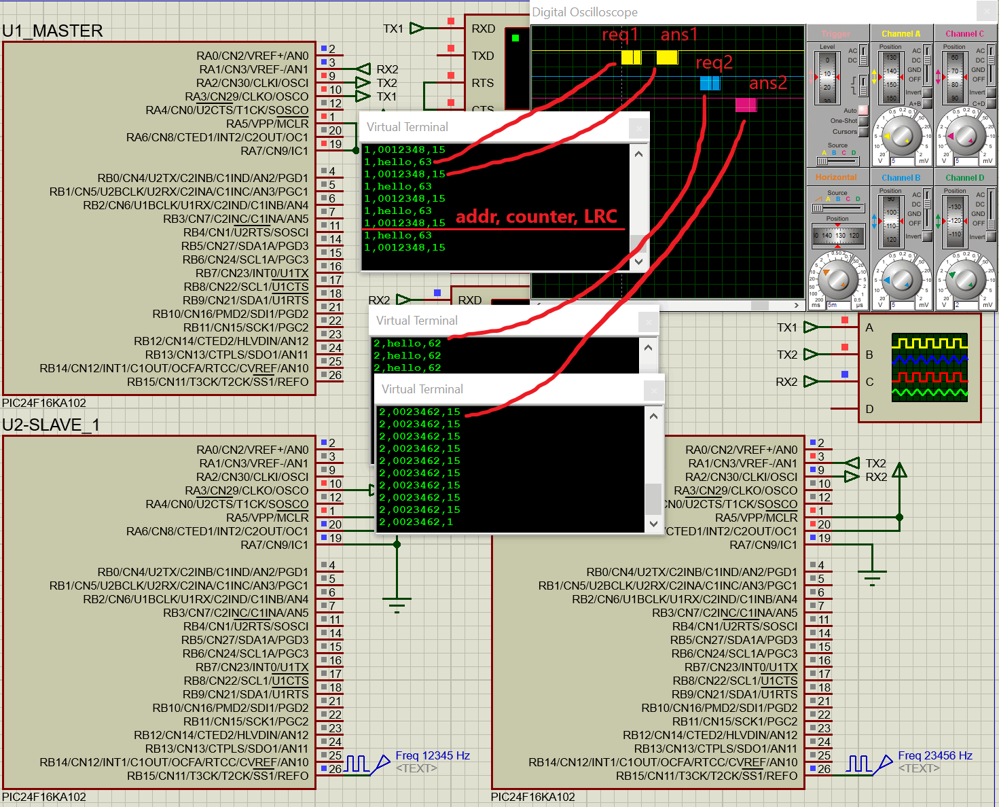

# Soft UART for PIC24F in single wire

Software UART for single-wire.  

It uses timer and CN-interrupts for detection and polling signal. 

## Software
- MPLAB.X IDE v5.5
- xc16 compiler v1.70
- Labcenter Proteus v8.10 SP3 for emulation

## Speeds
- MCU - 4 MIPS @ 8 MHz RC
- UART and Terminal - 19200 Baud
- Pulse generators 12345 Hz, 23456 Hz. 

